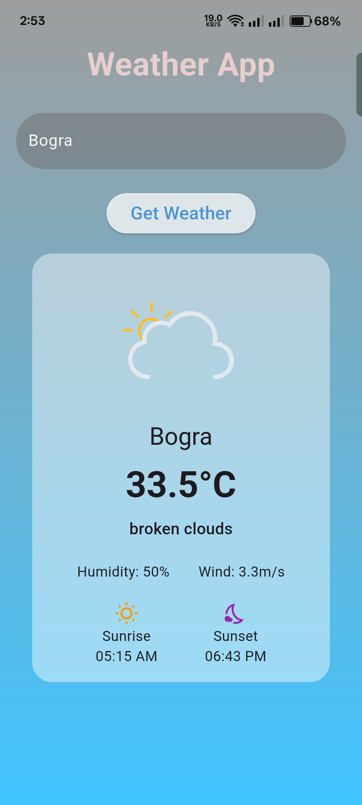

# 🌤️ Weather App (FLutter)

A beautiful Flutter-based weather application that provides real-time weather updates for any city worldwide using the OpenWeatherMap API.

## Features

- 🔍 Search weather by city name
- 🌡️ Real-time temperature display (in °C)
- ☔ Weather condition descriptions (e.g., Rain, Clear, Clouds)
- 💧 Humidity and wind speed indicators
- 🌅 Sunrise/Sunset times with beautiful animations
- 🎨 Dynamic background gradients based on weather conditions
- 📱 Responsive UI for all screen sizes
- 🌀 Lottie animations for weather states

## Technologies Used
Flutter (Mobile Framework)

OpenWeatherMap API (Weather Data)

Lottie (Animations)

HTTP (Network Requests)

## 📱 Screenshots

| Home Screen | Screenshot-1 | Screenshot-2 |
|-------------|-------------|-------------|
|  |  | 
## 🚀 Installation

1. **Clone the repository**
   ```bash
   git clone https://github.com/sohanurpub/myapp.git
   cd myapp

2. Get dependencies:

   ```bash
   flutter pub get

3. Run the app:

   ```bash
   flutter run

## 🏗️ Project Structure

    lib/
    ├── main.dart                # App entry point
    ├── models/
    │   └── weather_model.dart   # Data models
    ├── services/
    │   └── weather_services.dart # API services
    ├── widgets/
    │   └── weather_card.dart    # Reusable widgets
    └── screens/
    └── home_screen.dart     # Main screen
